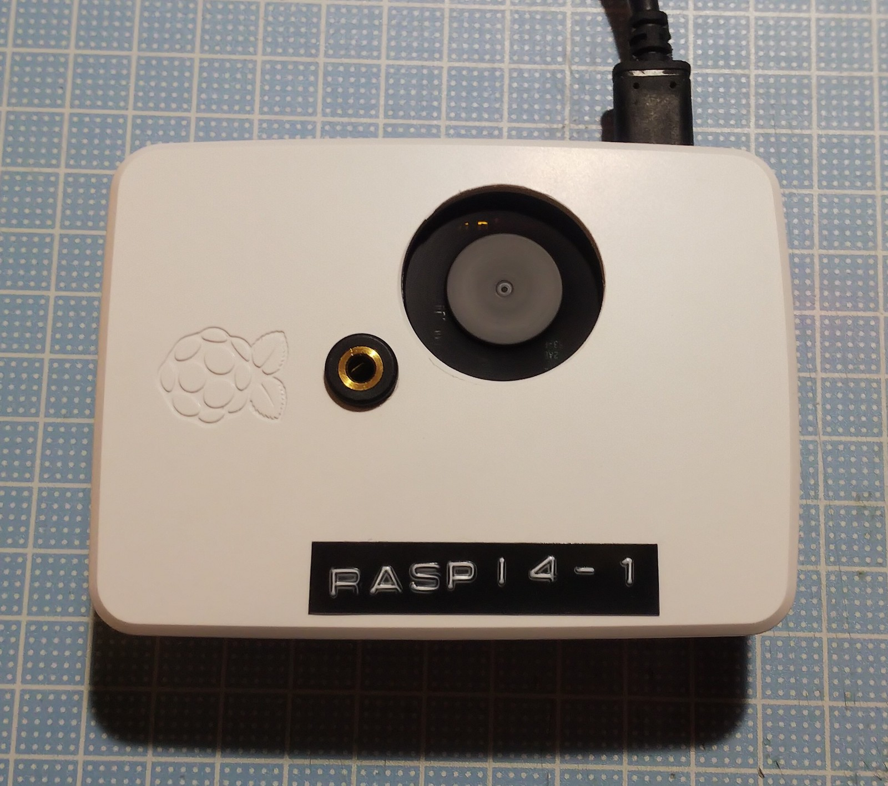
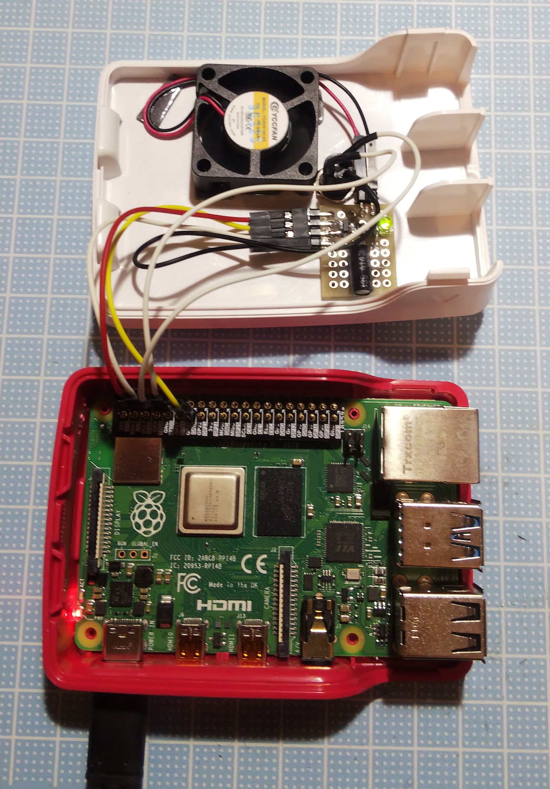
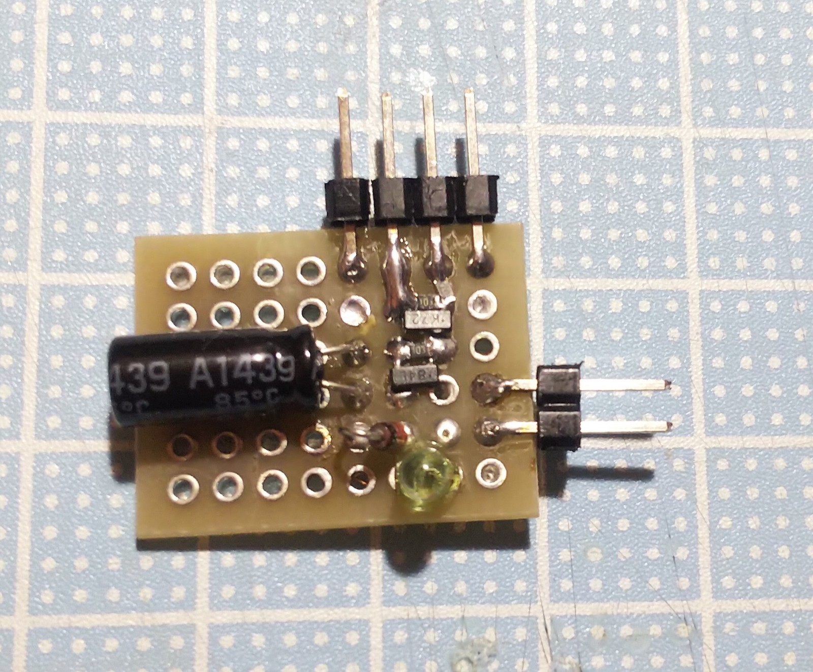
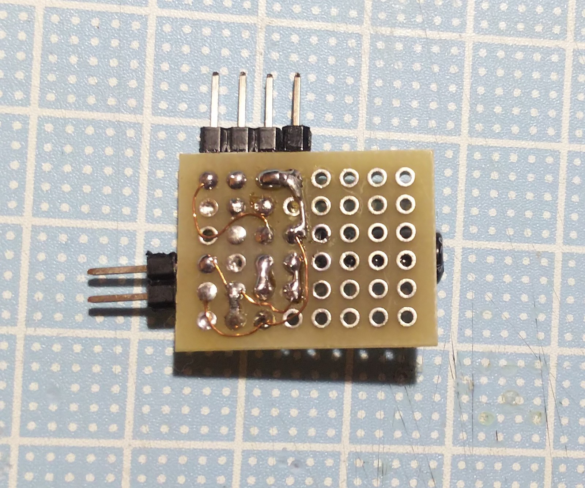

# Raspberry Pi4用ファンコントローラ

GPIOをON/OFFし、PWMでファンの速度をコントロールします。

# 回路図

新しい回路では、ファン出力の部分にダイオードとコンデンサーをいれています。

# 配線

GPIO27に信号線、プラスを+5V、マイナスをGNDに接続

# 導入と削除

## 起動

	$ make run

## ビルド

Golangが必要です。

	$ make build

## インストール

	$ sudo make install

## アンインストール

	$ sudo make uninstall

# 参考情報

温度とARMコア周波数の定時監視

	$ sh -c 'while true; do vcgencmd measure_temp; vcgencmd measure_clock arm; sleep 1; done'

